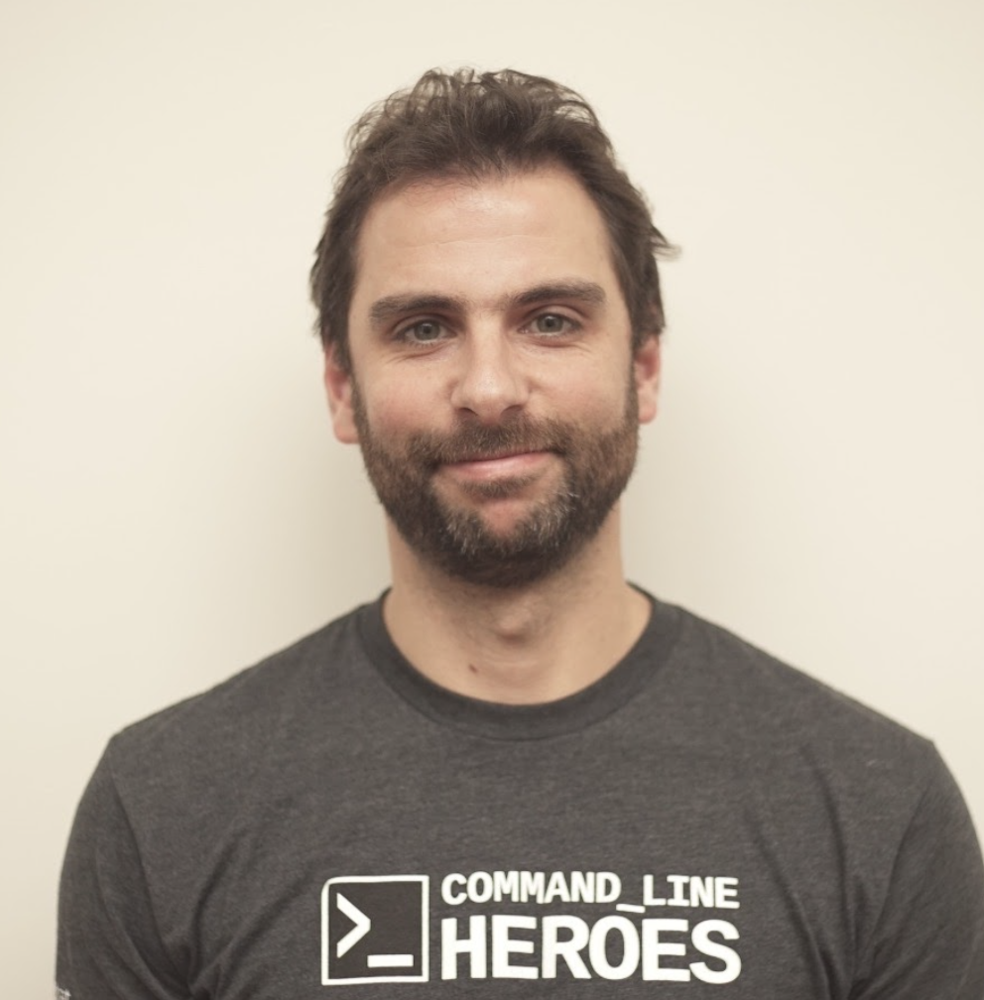

<p align = "center">

</p>

# Facultad de ingeniería | Escuela de tecnología - DevOps | Laboratorios

Estimados, sean bienvenidos al repositorio oficial para seguir las clases de los laboratorios.

Aquí van a encontrar material para hacer los prácticos correspondientes a las unidades temáticas en forma ordenada, encontrandose prácticas **OBLIGATORIAS** y **EXTRAS**.

## Estructura

El repositorio se organiza de la siguiente manera:

- **Extras:** Carpeta utilizada para almacenar contenido de multiple uso en el repositorio.
- **T0x - _NOMBRE_:** Laboratorios correspondientes a cada una de las unidades temáticas.
  - **Obligatorios:** Laboratorios obligatorios que se deben de realizar antes de avanzar con la unidad siguiente.
  - **Recomendadas:** Laboratorios recomendados para que puedan tener practicas extras sobre la unidad en cuestión.
- **Talleres:** Laboratorios correspondientes a las clases dictadas en modalidad de taller.

```
.
├── Extras
├── T01 - Nivelacion
│   ├── Obligatorias
│   ├── Recomendadas
├── T02 - Procesos DevOps
│   ├── Obligatorias
│   ├── Recomendadas
├── T03 - Herramientas CICD
│   ├── Obligatorias
│   ├── Recomendadas
├── T04 - Arquitectura y Microservicios
│   ├── Obligatorias
│   ├── Recomendadas
├── T05 - Cloud
│   ├── Obligatorias
│   ├── Recomendadas
├── T06 - Infrastructure as Code
│   ├── Obligatorias
│   ├── Recomendadas
├── T07 - Containers
│   ├── Obligatorias
│   ├── Recomendadas
├── T08 - Kubernetes
│   ├── Obligatorias
│   ├── Recomendadas
└── Talleres
```

## Links y información relevante

### Horarios
- **Lunes 19:00 a 22:00**
  - Recreo 20:00hs y 21:00hs de 15 minutos.
- **Martes 19:00 a 22:00**
  - Recreo 20:00hs y 21:00hs de 15 minutos.
- **Jueves 19:00 a 21:00**
  - Recreo 20:00hs de 20 minutos.
### Planillas
- [Planilla cuentas correo y usuarios GitHub](https://docs.google.com/spreadsheets/d/14h6BQUentSTJog88hHiJXqivTCRuze-6e0upkYFeJ-c/edit?usp=sharing)

### Grupo Telegram
- [Link del grupo](https://t.me/+RRVRxjXz4nxhNGU5)

### Contacto

- [Link de Zoom](https://aulas.ort.edu.uy/mod/url/view.php?id=495552)
- ID reunión: 96655503801
- Código de acceso: 8HrEYJazV

### Proyecto
- [Link del proyecto]()
- [Foro dudas proyecto](https://aulas.ort.edu.uy/mod/forum/view.php?id=359876)
## Equipo docente

Los docentes para el dictado somos:

<p align = "center">

</p>
<p align = "center"><strong>Lic. Federico Barceló</strong></p>
<p align = "center"><strong>federico@barcelo.com.uy</strong></p>

<p align = "center">

</p>
<p align = "center"><strong>Mauricio Améndola</strong></p>
<p align = "center"><strong>mauricio.amendola@fi365.ort.edu.uy</strong></p>

<p align = "center">

</p>
<p align = "center"><strong>Sebastián Orrego</srong></p>
<p align = "center"><strong>sebastian.orrego@gmail.com</strong></p>

<p align = "center">

</p>
<p align = "center"><strong>Christian Heredia</srong></p>
<p align = "center"><strong></strong></p>

