# Instalación ambiente

- Van a instalar o VirtualBox (Windows y MacOS) o WSL (Windows), la recomendación nuestra es que instalen VirtualBox y no WSL.
- SOLAMENTE van a hacer la guía si:
  - Se encuentran en Windows.
  - Se encuentran en macOS y quieren tener su máquina de trabajo aislada de la máquina que utilicen en el practico.

## VirtualBox

### Puntos a tener en consideración
- Activar el virtualización en el BIOS de los equipos, sin esto, es muy probable de que no podamos instalar VirtualBox o WSL.

## 1 - Descargar e instalar VirtualBox
- [Link de descarga VBOX](https://www.virtualbox.org/)

## 2 - Descargar imagen de Linux
- En mi caso, por preferencia voy a descargar y instalar un linux centOS.
- [Link de centOS](https://centos.org/download/)

## 3 - Instalar la VirtualMachine (VM)
- Con el VBOX instalado y la imagen descargada, vamos a instalar la VM.
- Seleccionamos en nueva
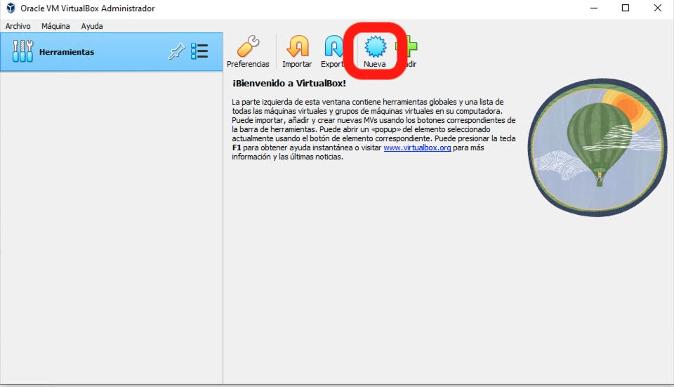
- Elegimos:
  - Nombre. 
  - Carpeta en donde alojar.
  - El archivo de la imagen que descargamos.

>Nota: Los demás campos deberían de autollenarse por defecto.

- Seleccionamos en Next.

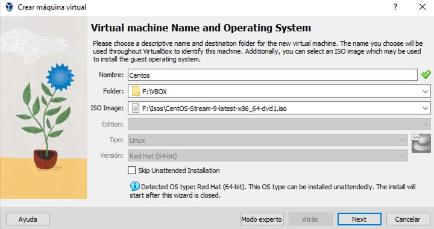

- Si se quiere, podemos modificar username y password, caso contrario n modificar y visualizar cuales son los valores para las credenciales.

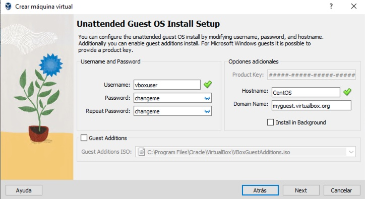

- Elegir al menos 4GB (4096MB) de memoria RAM y 2 CPU.
- Seleccionamos en next.

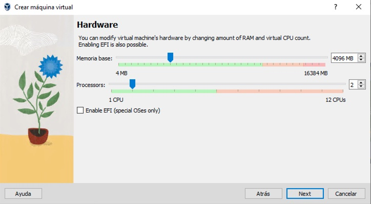

- Elegir al menos 40GB de disco duro.
- Seleccionamos en next.
- Y damos en terminar.

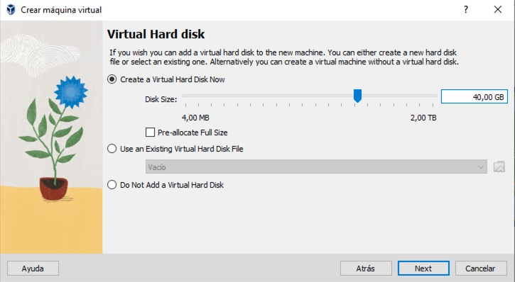

- Si sale todo ok, deberiamos de visualizar la ventana para empezar la instalación y procedmos a instalar el SO mediante la primer opción:

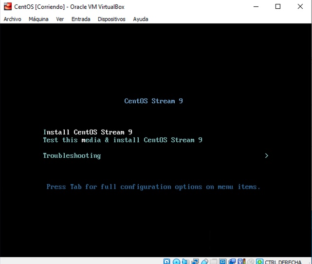

- **IMPORTANTE:** Verificar que este activada la network en la instalación:

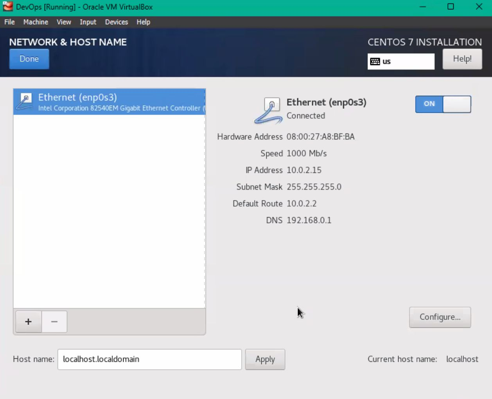

- Importante durante la instalación, habilitar el usuario root y permitir el acceso mediante SSH (el cual usaremos con VSC):

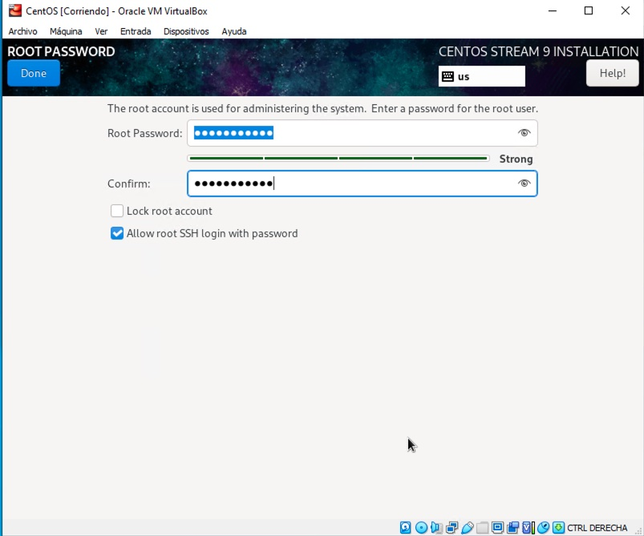

- Una vez configurado todos los valores necesarios, comenzara la instalación:

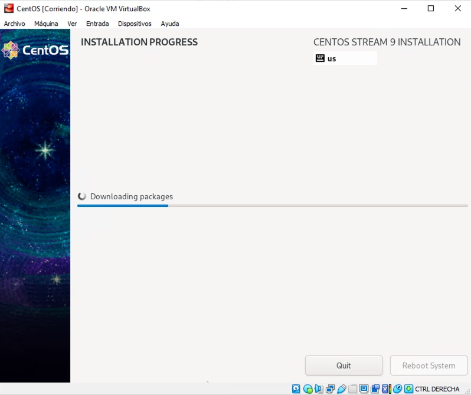

- Una vez haya terminado la instalación, es necesario instalar el cliente SSH en el centOS y luego en el VSC, para instalar en el centOS nos logeamos mediante la consola del VBOX y ejecutamos los siguientes comandos elevados:
  - `sudo yum install openssh-server`
  - `sudo systemctl start sshd.service`
  - `sudo systemctl enable sshd.service`
  - Por último ejecutamos el siguinte comando para verificar que tengamos el ssh ejecutandose: `sudo service sshd status`
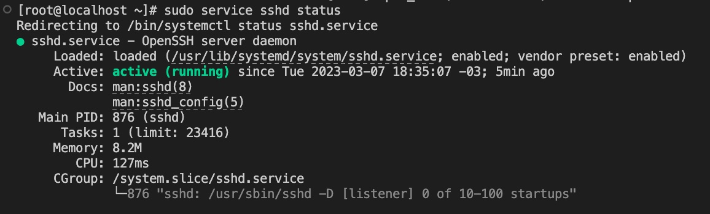

- Verificar que la configuración de red de la VBOX esta configurada como `adaptador puente`, por lo cual tomara una dirección IP de nuestro pool de DHCP.

- Verificar que se tenga conectividad a internet con el comando `ping 8.8.8.8`.

- Ingresar en la VBOX por su consolta y ejecutar el comando `ifconfig` para ver la dirección ip que tiene el equipo:

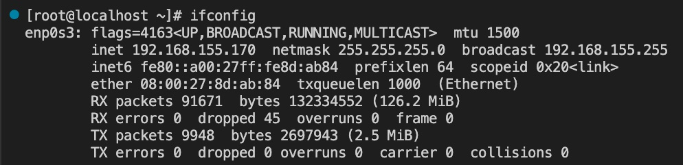

>Nota: En caso de no funcionar el comando ifconfig ejecutar la instalación de las nettools con el comando `yum install net-tools -y`

- Instalaremos el plugin de SSH en el VSC y configuraremos una nueva conexión con la dirección IP anterior y el usuario root como muestra la imagen:

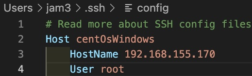

- Si salío todo correctamente, podremos ingresar al equipo mediante SSH por VSC.

## WSL

- Solamente tenemos que correr el comando `wsl.exe --install` en una consola con permisos elevados, una vez que termina, reiniciamos el equipo, se nos van a solicitar datos de usuario y contraseña para finalizar la instalación. Luego veremos que podremos ejecutar un Ubuntu desde el start menu.
- Van a tener que instalar el SSH como en la instalación de centOS y algun otro paquete extra (WSL instala Ubuntu, verificar como serian los comandos necesarios para instalar el SSH en Ubuntu).

