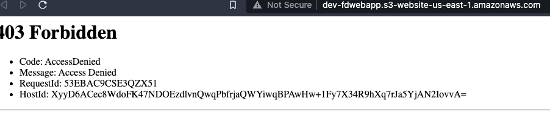
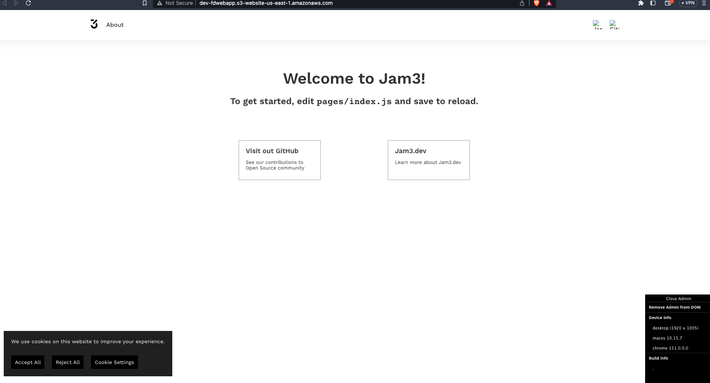

## Laboratorio

### 2.1 Generar repositorio de Github

- Generar repositorio de Github privado con las ramas (`main`,`staging`,`develop`) y subir el código de la aplicación que se encuentra en el `.zip` sobre la rama `develop`, para este laboratorio vamos a manejar un flujo de Gitflow.

### 2.2 Generar S3 buckets en AWS

- Generar 3 S3 buckets en la cuenta de AWS:
    - Utilizar nombres descriptivos.
        - EJ: `dev-githuba-fdwebapp`,`stg-githuba-fdwebapp`, `githuba-fdwebapp`.
    - **NOTA:** Cambiar el nombre del bucket por su nombre o alguna identificación propia, en mi caso yo puse fd por Federico. 
    - Verificar que los buckets quedan con la opción de `Block all public access` desactivada.
    - Verificar luego de una vez creados los buckets, que en la pestaña de `Properties` quede `Enabled` la opción de `Static website hosting`.

### 2.3 Estudiar carpeta .github

- Estudiar los archivos que se encuentran dentro de la carpeta `.github`, entender que es lo que realizan, cual es su relacionamiento entre si y que tipos de `SECRETS` se manejan.

### 2.4 Agregar secrets necesarios y ejecutar

- Agregar todos los secrets necesarios para que el build and deploy funcionen, una vez agregados, ejecutar manualmente (se puede llegar a ejecutar automático por tener trigger configurado los archivos) desde la consola de github actions el flujo para la rama `develop`, si se ejecuto correctamente.

- Si fue correcto el resultado del actions, buscar la URL de nuestro S3 bucket (la misma se encuentra en la ventana de properties y en el apartado de `Static website hosting`).
- Si podemos llegar al sitio y obtenemos un error 403 como la imagen, estamos en lo correcto: 

- Nos resta solamente habilitar permisos en el S3 bucket (buscar como solucionar permiso 403 en S3 bucket como website), cuando arreglen el error por el permiso, deberían de visualizar la siguiente imagen:

- Repetir los pasos para las ramas de `staging` y `main`, el pasaje de código realizarlo mediante pull request, pero previamente deben de haber cargado las variables.
